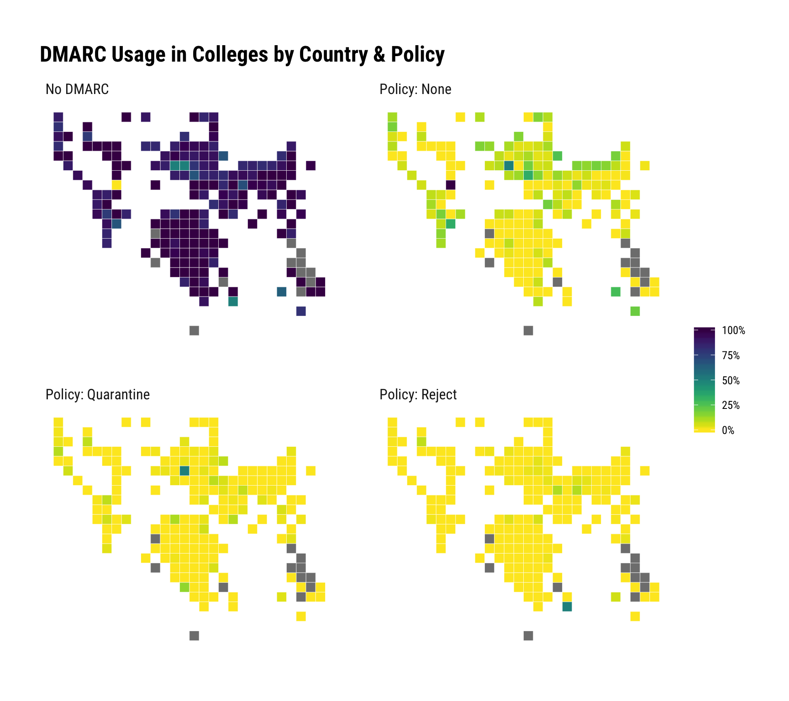

# dnshelpers

Tools to Process ‘DNS’ Response Data

## Description

The internet domain name system (‘DNS’) supports a wide variety of
response types besides simple ‘IP’ addresses or domain names. Methods
are provided to process a myriad of other response data elements
including ‘DMARC’ (‘TXT’), ‘SPF’ (‘TXT’), ‘MX’ and more.

## What’s Inside The Tin

The following functions are implemented:

  - `parse_dmarc`: Parse DMARCv1 DNS data reponses into a data frame
  - `parse_mta_sts`: Parse MTA-STS DNS data reponses into a list
  - `parse_mx`: Parse MX DNS data reponses into a data frame
  - `parse_soa`: Parse SOA DNS data reponses into a data frame
  - `parse_spf`: Parse SPF TXT DNS data reponses into a list

## Installation

``` r
devtools::install_github("hrbrmstr/dnshelpers")
```

## Usage

``` r
library(dnshelpers)
library(gdns)
library(worldtilegrid)
library(tidyverse)

# current verison
packageVersion("dnshelpers")
```

    ## [1] '0.1.0'

### Basics

``` r
targets <- c("senate.gov", "equifax.com", "rapid7.com")

bulk_query(targets, "MX") %>% 
  bind_cols(parse_mx(.$data))
```

    ## # A tibble: 7 x 7
    ##   name          type   TTL data                        query       preference data1                   
    ##   <chr>        <int> <int> <chr>                       <chr>            <int> <chr>                   
    ## 1 equifax.com.    15   309 20 smtp2.equifax.com.       equifax.com         20 smtp2.equifax.com.      
    ## 2 equifax.com.    15   309 10 smtp.equifax.com.        equifax.com         10 smtp.equifax.com.       
    ## 3 rapid7.com.     15   299 1 aspmx.l.google.com.       rapid7.com           1 aspmx.l.google.com.     
    ## 4 rapid7.com.     15   299 10 alt3.aspmx.l.google.com. rapid7.com          10 alt3.aspmx.l.google.com.
    ## 5 rapid7.com.     15   299 10 alt4.aspmx.l.google.com. rapid7.com          10 alt4.aspmx.l.google.com.
    ## 6 rapid7.com.     15   299 5 alt1.aspmx.l.google.com.  rapid7.com           5 alt1.aspmx.l.google.com.
    ## 7 rapid7.com.     15   299 5 alt2.aspmx.l.google.com.  rapid7.com           5 alt2.aspmx.l.google.com.

``` r
bulk_query(targets, "SOA") %>% 
  bind_cols(parse_soa(.$data))
```

    ## # A tibble: 3 x 12
    ##   name          type   TTL data                      query   mname     rname       serial  refresh retry expire minimum
    ##   <chr>        <int> <int> <chr>                     <chr>   <chr>     <chr>       <chr>     <dbl> <dbl>  <dbl>   <dbl>
    ## 1 senate.gov.      6 10384 sen-dmzp.senate.gov. saa… senate… sen-dmzp… saanoc.saa… 200810…    1800   900 2.59e6     900
    ## 2 equifax.com.     6   170 ns0.equifax.com. hostmas… equifa… ns0.equi… hostmaster… 201808…   10800  3600 2.42e6     900
    ## 3 rapid7.com.      6   308 ns-1653.awsdns-14.co.uk.… rapid7… ns-1653.… awsdns-hos… 1          7200   900 1.21e6   86400

``` r
bulk_query(sprintf("_dmarc.%s", targets), "TXT") %>% 
  filter(str_detect(str_to_lower(data), "dmarc1")) %>% 
  bind_cols(parse_dmarc(.$data))
```

    ## # A tibble: 2 x 14
    ##   name                type   TTL data              query  v     p     sp    pct   rf    rua      ruf     is_valid fo   
    ##   <chr>              <int> <int> <chr>             <chr>  <chr> <chr> <chr> <chr> <chr> <chr>    <chr>   <lgl>    <chr>
    ## 1 _dmarc.senate.gov.    16 10070 "\"v=DMARC1;\"\"… _dmar… dmar… reje… none  100   afrf  mailto:… mailto… TRUE     <NA> 
    ## 2 _dmarc.rapid7.com.    16   299 "\"v=DMARC1; p=n… _dmar… dmar… none  <NA>  <NA>  <NA>  mailto:… mailto… TRUE     0

``` r
bulk_query(targets, "TXT") %>% 
  filter(str_detect(str_to_lower(data), "v=spf")) %>% 
  .$data %>% 
  parse_spf() %>% 
  str()
```

    ## List of 3
    ##  $ :List of 4
    ##   ..$ mechasims :List of 1
    ##   .. ..$ :Classes 'tbl_df', 'tbl' and 'data.frame':  1 obs. of  3 variables:
    ##   .. .. ..$ qualifier: chr "-"
    ##   .. .. ..$ mechanism: chr "all"
    ##   .. .. ..$ data     : chr NA
    ##   ..$ modifiers :List of 1
    ##   .. ..$ :Classes 'tbl_df', 'tbl' and 'data.frame':  0 obs. of  0 variables
    ##   ..$ valid     : logi TRUE
    ##   ..$ spf_record: chr "\"v=spf1 -all\""
    ##  $ :List of 4
    ##   ..$ mechasims :List of 1
    ##   .. ..$ :Classes 'tbl_df', 'tbl' and 'data.frame':  17 obs. of  3 variables:
    ##   .. .. ..$ qualifier: chr [1:17] "+" "+" "+" "+" ...
    ##   .. .. ..$ mechanism: chr [1:17] "ip4" "ip4" "ip4" "ip4" ...
    ##   .. .. ..$ data     : chr [1:17] "216.46.96.0/24" "12.104.201.0/24" "12.178.18.150/32" "68.233.76.14/32" ...
    ##   ..$ modifiers :List of 1
    ##   .. ..$ :Classes 'tbl_df', 'tbl' and 'data.frame':  0 obs. of  0 variables
    ##   ..$ valid     : logi TRUE
    ##   ..$ spf_record: chr "\"v=spf1 ip4:216.46.96.0/24 ip4:12.104.201.0/24 ip4:12.178.18.150/32 ip4:68.233.76.14/32 ip4:198.60.22.202/32 i"| __truncated__
    ##  $ :List of 4
    ##   ..$ mechasims :List of 1
    ##   .. ..$ :Classes 'tbl_df', 'tbl' and 'data.frame':  13 obs. of  3 variables:
    ##   .. .. ..$ qualifier: chr [1:13] "+" "+" "+" "+" ...
    ##   .. .. ..$ mechanism: chr [1:13] "ip4" "ip4" "ip4" "ip4" ...
    ##   .. .. ..$ data     : chr [1:13] "208.118.237.0/24" "208.118.227.0/25" "64.125.235.5" "64.125.235.6" ...
    ##   ..$ modifiers :List of 1
    ##   .. ..$ :Classes 'tbl_df', 'tbl' and 'data.frame':  0 obs. of  0 variables
    ##   ..$ valid     : logi TRUE
    ##   ..$ spf_record: chr "\"v=spf1 ip4:208.118.237.0/24 ip4:208.118.227.0/25 ip4:64.125.235.5 ip4:64.125.235.6 ip4:205.201.137.229 ip4:20"| __truncated__

### Practical Example (DMARC)

Let’s see how the [world’s
colleges](https://raw.githubusercontent.com/Hipo/university-domains-list/master/world_universities_and_domains.json)
rate DMARC-wise.

We’ll take ^^ JSON and lookup DMARC records via the `zdnsr` package
(`hrbrmstr/zdnsr`).

``` r
(u_dmarc <- readRDS("ghdat/uinv_dmarc.rds")) # previously read in
```

    ## # A tibble: 9,738 x 5
    ##    name                                      country       alpha_two_code domains        dmarc                
    ##    <chr>                                     <chr>         <chr>          <chr>          <chr>                
    ##  1 Cégep de Saint-Jérôme                     Canada        CA             cstj.qc.ca     _dmarc.cstj.qc.ca    
    ##  2 Lindenwood University                     United States US             lindenwood.edu _dmarc.lindenwood.edu
    ##  3 DAV Institute of Engineering & Technology India         IN             davietjal.org  _dmarc.davietjal.org 
    ##  4 Lovely Professional University            India         IN             lpu.in         _dmarc.lpu.in        
    ##  5 Sullivan University                       United States US             sullivan.edu   _dmarc.sullivan.edu  
    ##  6 Florida State College at Jacksonville     United States US             fscj.edu       _dmarc.fscj.edu      
    ##  7 Xavier University                         United States US             xavier.edu     _dmarc.xavier.edu    
    ##  8 Tusculum College                          United States US             tusculum.edu   _dmarc.tusculum.edu  
    ##  9 Claremont School of Theology              United States US             cst.edu        _dmarc.cst.edu       
    ## 10 Somaiya Vidyavihar                        India         IN             somaiya.edu    _dmarc.somaiya.edu   
    ## # ... with 9,728 more rows

``` r
## Done previously:
# zdnsr::zdns_query(u_dmarc$dmarc, output_file = "somefile.json", query_type = "TXT")  
# db <- sergeant::src_drill()
# 
# tbl(db, "(
# SELECT
#   b.answers.name AS question,
#   b.answers.answer AS answer
# FROM (
#   SELECT 
#     FLATTEN(a.data.answers) AS answers
#   FROM 
#     dfs.workspace.`/somefile.json` a
#   WHERE 
#     (a.status = 'NOERROR')
# ) b
# )") %>% 
#   collect() -> dmarc_recs

(dmarc_recs <- readRDS("ghdat/dmarc-recs.rds")) # what was previously looked up ^^
```

    ## # A tibble: 1,250 x 2
    ##    question             answer                                                                                         
    ##  * <chr>                <chr>                                                                                          
    ##  1 _dmarc.washjeff.edu  v=DMARC1; p=none                                                                               
    ##  2 _dmarc.barry.edu     v=DMARC1; p=none; rua=mailto:dmpost@barry.edu,mailto:7cc566d7@mxtoolbox.dmarc-report.com; ruf=…
    ##  3 _dmarc.yhc.edu       v=DMARC1; pct=100; p=none                                                                      
    ##  4 _dmarc.aacc.edu      v=DMARC1;p=none; rua=mailto:DKIM_DMARC@aacc.edu;ruf=mailto:DKIM_DMARC@aacc.edu;fo=1            
    ##  5 _dmarc.sagu.edu      v=DMARC1; p=none; rua=mailto:Office365contact@sagu.edu; ruf=mailto:Office365contact@sagu.edu   
    ##  6 _dmarc.colostate.edu v=DMARC1; p=none; pct=100; rua=mailto:re+anahykughvo@dmarc.postmarkapp.com; sp=none; aspf=r;   
    ##  7 _dmarc.wne.edu       v=DMARC1;p=quarantine;sp=none;fo=1;ri=86400;pct=50;rua=mailto:dmarcreply@wne.edu               
    ##  8 _dmarc.csuglobal.edu v=DMARC1; p=none;                                                                              
    ##  9 _dmarc.devry.edu     v=DMARC1; p=none; pct=100; rua=mailto:devry@rua.agari.com; ruf=mailto:devry@ruf.agari.com; fo=1
    ## 10 _dmarc.sullivan.edu  v=DMARC1; p=none; rua=mailto:mcambron@sullivan.edu; ruf=mailto:mcambron@sullivan.edu; fo=1     
    ## # ... with 1,240 more rows

``` r
left_join( # join them together
  u_dmarc, 
  bind_cols(
    dmarc_recs,
    parse_dmarc(dmarc_recs$answer) # parse the raw DMARC records
  ),
  by = c("dmarc"="question")
) %>% 
  mutate(p = ifelse(is.na(p), "NO_DMARC", p)) %>%  
  print() -> processed_dmarc
```

    ## # A tibble: 9,826 x 17
    ##    name   country  alpha_two_code domains  dmarc answer  v     p     is_valid adkim fo    rf    rua   ruf   pct   sp   
    ##    <chr>  <chr>    <chr>          <chr>    <chr> <chr>   <chr> <chr> <lgl>    <chr> <chr> <chr> <chr> <chr> <chr> <chr>
    ##  1 Cégep… Canada   CA             cstj.qc… _dma… <NA>    <NA>  NO_D… NA       <NA>  <NA>  <NA>  <NA>  <NA>  <NA>  <NA> 
    ##  2 Linde… United … US             lindenw… _dma… <NA>    <NA>  NO_D… NA       <NA>  <NA>  <NA>  <NA>  <NA>  <NA>  <NA> 
    ##  3 DAV I… India    IN             davietj… _dma… <NA>    <NA>  NO_D… NA       <NA>  <NA>  <NA>  <NA>  <NA>  <NA>  <NA> 
    ##  4 Lovel… India    IN             lpu.in   _dma… <NA>    <NA>  NO_D… NA       <NA>  <NA>  <NA>  <NA>  <NA>  <NA>  <NA> 
    ##  5 Sulli… United … US             sulliva… _dma… v=DMAR… dmar… none  TRUE     <NA>  1     <NA>  mail… mail… <NA>  <NA> 
    ##  6 Flori… United … US             fscj.edu _dma… <NA>    <NA>  NO_D… NA       <NA>  <NA>  <NA>  <NA>  <NA>  <NA>  <NA> 
    ##  7 Xavie… United … US             xavier.… _dma… <NA>    <NA>  NO_D… NA       <NA>  <NA>  <NA>  <NA>  <NA>  <NA>  <NA> 
    ##  8 Tuscu… United … US             tusculu… _dma… <NA>    <NA>  NO_D… NA       <NA>  <NA>  <NA>  <NA>  <NA>  <NA>  <NA> 
    ##  9 Clare… United … US             cst.edu  _dma… <NA>    <NA>  NO_D… NA       <NA>  <NA>  <NA>  <NA>  <NA>  <NA>  <NA> 
    ## 10 Somai… India    IN             somaiya… _dma… v=DMAR… dmar… quar… TRUE     <NA>  <NA>  <NA>  mail… <NA>  <NA>  <NA> 
    ## # ... with 9,816 more rows, and 1 more variable: ri <chr>

``` r
count(processed_dmarc, alpha_two_code, p) %>% # do a bunch of cleanup & re-org to get policy % by country
  spread(p, n) %>%
  gather(p, n, -alpha_two_code) %>% 
  mutate(n = ifelse(is.na(n), 0, n)) %>% 
  group_by(alpha_two_code) %>% 
  mutate(pct = n/sum(n)) %>% 
  ungroup() %>% 
  select(alpha_two_code, p, pct) %>% 
  spread(p, pct) %>% 
  gather(measure, value, -alpha_two_code) %>% 
  mutate(
    measure = factor( # make the DMARC policy ids a bit nicer for the facets
      x = measure, 
      levels = c("NO_DMARC", "none", "quarantine", "reject"),
      labels = c("No DMARC", "Policy: None", "Policy: Quarantine", "Policy: Reject")
    )
  ) %>% 
  print() %>% 
  ggplot(aes(country = alpha_two_code, fill = value)) +
  geom_wtg() +
  viridis::scale_fill_viridis(name = NULL, direction = -1, labels=scales::percent) +
  facet_wrap(~measure) +
  coord_equal() +
  labs(
    x=NULL, y=NULL, title = "DMARC Usage in Colleges by Country & Policy"
  ) +
  hrbrthemes::theme_ipsum_rc(grid="XY") + 
  theme_enhance_wtg()
```

    ## # A tibble: 816 x 3
    ##    alpha_two_code measure  value
    ##    <chr>          <fct>    <dbl>
    ##  1 AD             No DMARC 1    
    ##  2 AE             No DMARC 0.971
    ##  3 AF             No DMARC 0.976
    ##  4 AG             No DMARC 1    
    ##  5 AL             No DMARC 1    
    ##  6 AM             No DMARC 0.833
    ##  7 AO             No DMARC 1    
    ##  8 AR             No DMARC 0.852
    ##  9 AT             No DMARC 0.791
    ## 10 AU             No DMARC 0.627
    ## # ... with 806 more rows


